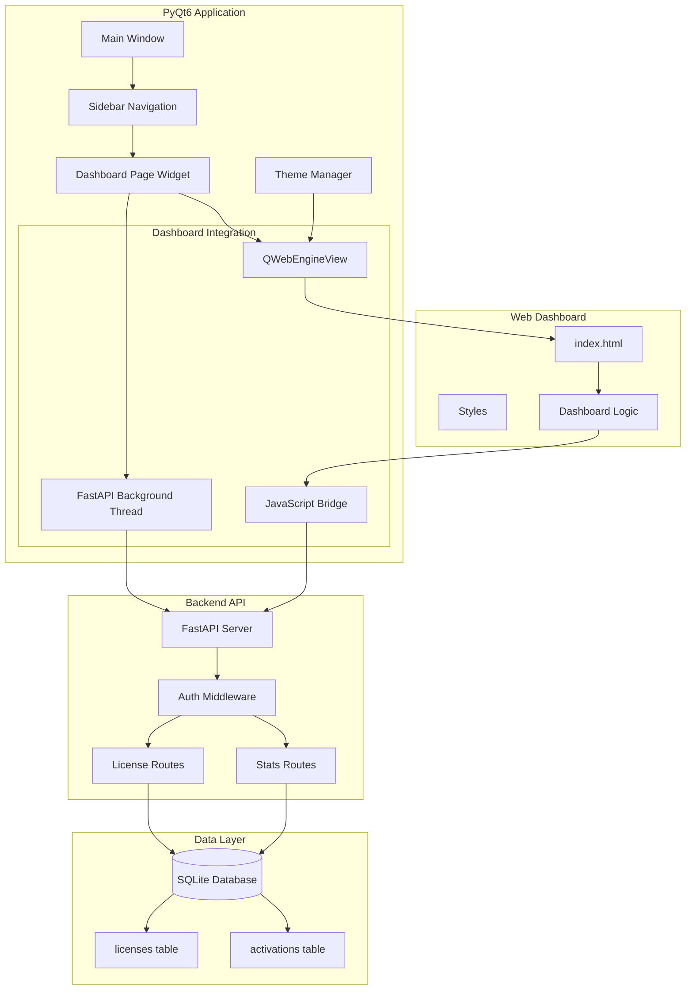
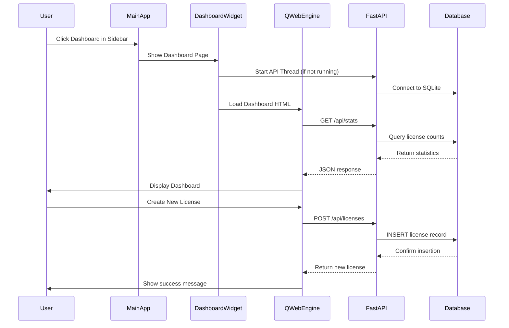

# Design Document: Integrated License Dashboard

## Overview

The Integrated License Dashboard is a comprehensive license management system embedded directly within the Harmulizer Pro PyQt6 application. It provides administrators with a modern, web-based interface for managing software licenses, activations, and customer information without requiring a separate application.

### Key Design Goals

1. **Seamless Integration**: Embed a web-based dashboard within the PyQt6 application using QWebEngineView
2. **Unified Experience**: Maintain visual consistency with the main application's theme system
3. **Self-Contained Backend**: Run a FastAPI server as a background thread within the application
4. **Real-Time Updates**: Provide live statistics and instant feedback on all operations
5. **Responsive Design**: Adapt to different window sizes while maintaining usability
6. **Secure Access**: Implement authentication and authorization for all administrative operations

### Architecture Philosophy

The design follows a **hybrid architecture** pattern:
- **Frontend**: HTML/CSS/JavaScript dashboard served through QWebEngineView
- **Backend**: FastAPI REST API running in a background thread
- **Integration Layer**: PyQt6 bridge connecting the embedded view to the application
- **Data Layer**: Shared SQLite database accessed by both the main app and dashboard API

This approach provides the flexibility of web technologies while maintaining the integration benefits of a desktop application.

## Architecture

### System Architecture Diagram



### Component Interaction Flow



### Threading Model

```
Main Thread (PyQt6)
├── UI Event Loop
├── Main Window
├── Dashboard Widget
│   └── QWebEngineView (Chromium Process)
│
Background Thread (FastAPI)
├── Uvicorn Server
├── Request Handlers
└── Database Connections
```

**Thread Safety Considerations**:
- FastAPI runs in a separate daemon thread
- Database connections use thread-local sessions
- No direct shared state between threads
- Communication via HTTP only

## Components and Interfaces

### 1. Dashboard Page Widget (PyQt6)

**File**: `app/ui/license_dashboard_page.py`

**Responsibilities**:
- Manage the QWebEngineView instance
- Start/stop the FastAPI backend thread
- Handle theme synchronization
- Provide JavaScript bridge for theme updates

**Key Methods**:
```python
class LicenseDashboardPage(QWidget):
    def __init__(self, license_manager: LicenseManager, theme_manager: ThemeManager)
    def start_api_server(self) -> bool
    def stop_api_server(self) -> None
    def sync_theme(self) -> None
    def inject_theme_css(self, theme: str) -> None
    def handle_api_error(self, error: Exception) -> None
```

**Interface Contract**:
- **Input**: Theme settings from ThemeManager
- **Output**: Embedded web dashboard display
- **Side Effects**: Starts/stops background API thread

### 2. FastAPI Backend Server

**File**: `license_dashboard/main.py` (existing, to be integrated)

**Responsibilities**:
- Expose REST API endpoints for license management
- Handle authentication and authorization
- Perform database operations
- Return JSON responses

**Key Endpoints**:
```python
GET    /api/stats                    # Get dashboard statistics
GET    /api/licenses                 # List all licenses (with filters)
POST   /api/licenses                 # Create new license
GET    /api/licenses/{id}            # Get license details
PUT    /api/licenses/{id}            # Update license
DELETE /api/licenses/{id}            # Delete license
POST   /api/verify                   # Verify license (public)
POST   /api/deactivate               # Deactivate license
GET    /api/licenses/{id}/activations # Get license activations
DELETE /api/activations/{id}         # Deactivate specific activation
```

**Authentication**:
- Bearer token authentication for admin endpoints
- Token stored in application configuration
- Public endpoints (verify, deactivate) don't require auth

### 3. Web Dashboard Frontend

**File**: `license_dashboard/index.html` (existing)

**Responsibilities**:
- Render license management interface
- Handle user interactions
- Make API requests
- Display real-time statistics
- Implement responsive design

**Key Components**:
- Statistics Cards (total, active, expired, by tier)
- License Table (sortable, filterable)
- Create License Modal
- Edit License Modal
- Search and Filter Controls
- WhatsApp Integration Button

**API Client**:
```javascript
class DashboardAPI {
    constructor(baseURL, authToken)
    async getStats()
    async getLicenses(filters)
    async createLicense(data)
    async updateLicense(id, data)
    async deleteLicense(id)
    async getLicenseActivations(id)
    async deactivateActivation(id)
}
```

### 4. API Thread Manager

**File**: `app/core/api_thread.py` (new)

**Responsibilities**:
- Manage FastAPI server lifecycle
- Run server in background thread
- Handle graceful shutdown
- Monitor server health

**Implementation**:
```python
class APIServerThread(QThread):
    server_started = pyqtSignal(str)  # Emits server URL
    server_error = pyqtSignal(str)    # Emits error message
    
    def __init__(self, port: int = 8000, db_path: str = "licenses.db")
    def run(self) -> None
    def stop(self) -> None
    def is_running(self) -> bool
    def get_server_url(self) -> str
```

### 5. Theme Bridge

**File**: `app/ui/theme_bridge.py` (new)

**Responsibilities**:
- Synchronize theme between PyQt6 and web dashboard
- Inject CSS variables into QWebEngineView
- Handle theme change events

**Implementation**:
```python
class ThemeBridge:
    def __init__(self, web_view: QWebEngineView, theme_manager: ThemeManager)
    def sync_theme(self) -> None
    def get_theme_css(self, theme: str) -> str
    def inject_css(self, css: str) -> None
    def on_theme_changed(self, new_theme: str) -> None
```

**Theme CSS Variables**:
```css
:root {
    --bg-primary: #0f0f23;
    --bg-secondary: #1a1a2e;
    --bg-card: #16213e;
    --accent: #4f46e5;
    --text-primary: #e5e7eb;
    --text-secondary: #9ca3af;
    --border: #374151;
}
```

### 6. Database Schema

**Tables**:

```sql
-- licenses table
CREATE TABLE licenses (
    id TEXT PRIMARY KEY,
    key TEXT UNIQUE NOT NULL,
    tier TEXT DEFAULT 'basic',
    email TEXT,
    customer_name TEXT,
    whatsapp TEXT,
    created_at DATETIME DEFAULT CURRENT_TIMESTAMP,
    expires_at DATETIME,
    is_active BOOLEAN DEFAULT 1,
    max_activations INTEGER DEFAULT 1,
    notes TEXT,
    custom_features JSON,
    last_modified DATETIME DEFAULT CURRENT_TIMESTAMP
);

CREATE INDEX idx_licenses_key ON licenses(key);
CREATE INDEX idx_licenses_email ON licenses(email);
CREATE INDEX idx_licenses_tier ON licenses(tier);
CREATE INDEX idx_licenses_is_active ON licenses(is_active);

-- activations table
CREATE TABLE activations (
    id TEXT PRIMARY KEY,
    license_id TEXT NOT NULL,
    machine_id TEXT NOT NULL,
    activated_at DATETIME DEFAULT CURRENT_TIMESTAMP,
    last_seen DATETIME DEFAULT CURRENT_TIMESTAMP,
    is_active BOOLEAN DEFAULT 1,
    FOREIGN KEY (license_id) REFERENCES licenses(id) ON DELETE CASCADE
);

CREATE INDEX idx_activations_license_id ON activations(license_id);
CREATE INDEX idx_activations_machine_id ON activations(machine_id);
CREATE INDEX idx_activations_is_active ON activations(is_active);
```

## Data Models

### License Model

```python
@dataclass
class License:
    id: str
    key: str
    tier: str  # free, basic, pro, enterprise
    email: Optional[str]
    customer_name: Optional[str]
    whatsapp: Optional[str]
    created_at: datetime
    expires_at: Optional[datetime]
    is_active: bool
    max_activations: int
    notes: Optional[str]
    custom_features: Dict[str, Any]
    last_modified: datetime
    
    def is_expired(self) -> bool:
        """Check if license has expired"""
        if not self.expires_at:
            return False
        return datetime.utcnow() > self.expires_at
    
    def days_until_expiry(self) -> Optional[int]:
        """Get days until expiration"""
        if not self.expires_at:
            return None
        delta = self.expires_at - datetime.utcnow()
        return max(0, delta.days)
    
    def current_activations_count(self, db: Session) -> int:
        """Get count of active activations"""
        return db.query(Activation).filter(
            Activation.license_id == self.id,
            Activation.is_active == True
        ).count()
    
    def can_activate(self, db: Session) -> bool:
        """Check if license can accept new activation"""
        if not self.is_active or self.is_expired():
            return False
        return self.current_activations_count(db) < self.max_activations
```

### Activation Model

```python
@dataclass
class Activation:
    id: str
    license_id: str
    machine_id: str
    activated_at: datetime
    last_seen: datetime
    is_active: bool
    
    def update_last_seen(self, db: Session) -> None:
        """Update last seen timestamp"""
        self.last_seen = datetime.utcnow()
        db.commit()
    
    def deactivate(self, db: Session) -> None:
        """Mark activation as inactive"""
        self.is_active = False
        db.commit()
```

### Statistics Model

```python
@dataclass
class DashboardStats:
    total_licenses: int
    active_licenses: int
    expired_licenses: int
    by_tier: Dict[str, int]  # {tier: count}
    total_activations: int
    revenue_monthly: float
    revenue_annual: float
    
    @classmethod
    def calculate(cls, db: Session) -> 'DashboardStats':
        """Calculate statistics from database"""
        total = db.query(License).count()
        active = db.query(License).filter(License.is_active == True).count()
        
        now = datetime.utcnow()
        expired = db.query(License).filter(
            License.expires_at != None,
            License.expires_at < now
        ).count()
        
        by_tier = {}
        for tier in ["free", "basic", "pro", "enterprise"]:
            count = db.query(License).filter(License.tier == tier).count()
            by_tier[tier] = count
        
        total_activations = db.query(Activation).filter(
            Activation.is_active == True
        ).count()
        
        # Calculate revenue
        revenue_monthly = sum(
            PRICING.get(lic.tier, {}).get("price", 0)
            for lic in db.query(License).filter(License.is_active == True).all()
        )
        revenue_annual = revenue_monthly * 12
        
        return cls(
            total_licenses=total,
            active_licenses=active,
            expired_licenses=expired,
            by_tier=by_tier,
            total_activations=total_activations,
            revenue_monthly=revenue_monthly,
            revenue_annual=revenue_annual
        )
```

### Request/Response Models

```python
# Create License Request
class LicenseCreateRequest(BaseModel):
    tier: str = "basic"
    email: Optional[str] = None
    customer_name: Optional[str] = None
    whatsapp: Optional[str] = None
    days_valid: Optional[int] = 30
    max_activations: int = 1
    notes: Optional[str] = None
    custom_features: Optional[Dict[str, Any]] = None

# Update License Request
class LicenseUpdateRequest(BaseModel):
    tier: Optional[str] = None
    email: Optional[str] = None
    customer_name: Optional[str] = None
    whatsapp: Optional[str] = None
    is_active: Optional[bool] = None
    expires_at: Optional[datetime] = None
    max_activations: Optional[int] = None
    notes: Optional[str] = None
    custom_features: Optional[Dict[str, Any]] = None

# License Response
class LicenseResponse(BaseModel):
    id: str
    key: str
    tier: str
    email: Optional[str]
    customer_name: Optional[str]
    whatsapp: Optional[str]
    created_at: datetime
    expires_at: Optional[datetime]
    is_active: bool
    max_activations: int
    current_activations: int
    notes: Optional[str]
    custom_features: Dict[str, Any]
    last_modified: datetime
```


## Correctness Properties

*A property is a characteristic or behavior that should hold true across all valid executions of a system—essentially, a formal statement about what the system should do. Properties serve as the bridge between human-readable specifications and machine-verifiable correctness guarantees.*

### Property Reflection

After analyzing all acceptance criteria, I identified several areas where properties can be consolidated:

**Consolidation Decisions**:
1. Statistics display properties (4.1-4.4) can be combined into one comprehensive property about statistics completeness
2. Theme synchronization properties (6.1-6.3, 6.5) can be combined into one property about theme consistency
3. Validation properties (10.2-10.4) can be combined into one property about input validation
4. Filter properties (5.5-5.7) can be combined into one property about filtering behavior

### Property 1: API Server Lifecycle

*For any* application start, the Backend_API server SHALL start automatically in a background thread and listen on the configured port (default 8000).

**Validates: Requirements 1.6, 1.7, 7.1**

### Property 2: Dashboard Page Accessibility

*For any* user interaction with the sidebar, selecting the dashboard page SHALL display the license management interface loaded from the Backend_API.

**Validates: Requirements 1.2, 1.5**

### Property 3: License Key Format

*For any* generated license key, it SHALL follow the format {TIER_PREFIX}-XXXX-XXXX-XXXX-XXXX where TIER_PREFIX is HMF (free), HMB (basic), HMP (pro), or HME (enterprise).

**Validates: Requirements 2.4**

### Property 4: License Key Uniqueness

*For any* license creation request, the system SHALL verify that the generated key does not already exist in the database before storing it.

**Validates: Requirements 2.3, 10.7**

### Property 5: License Creation Persistence

*For any* valid license creation request, the License_Manager SHALL store the license in the database with a creation timestamp and return the complete license record.

**Validates: Requirements 2.5**

### Property 6: License Update Timestamp

*For any* license update operation, the License_Manager SHALL update the last_modified timestamp to the current time.

**Validates: Requirements 2.7**

### Property 7: Cascade Deletion

*For any* confirmed license deletion, the License_Manager SHALL remove both the License_Record and all associated Activation records from the database.

**Validates: Requirements 2.9**

### Property 8: Deletion Confirmation

*For any* license deletion request, the License_Dashboard SHALL prompt the user for confirmation before proceeding with the deletion.

**Validates: Requirements 2.8**

### Property 9: Activation Display Completeness

*For any* license record viewed by the admin, the dashboard SHALL display the current activation count, maximum allowed activations, and a list of all active activations with their Machine_ID, activation date, and last seen timestamp.

**Validates: Requirements 3.1, 3.2, 3.3**

### Property 10: Activation Count Decrement

*For any* activation deactivation operation, the License_Manager SHALL mark the activation as inactive and the current activation count SHALL decrease by one.

**Validates: Requirements 3.4, 3.5**

### Property 11: Activation Limit Warning

*For any* license where current_activations >= (max_activations * 0.8), the License_Dashboard SHALL display a warning indicator.

**Validates: Requirements 3.6**

### Property 12: Statistics Completeness

*For any* dashboard load or data change, the License_Dashboard SHALL display statistics cards showing total licenses, active licenses, expired licenses, and counts by tier (free, basic, pro, enterprise).

**Validates: Requirements 4.1, 4.2, 4.3, 4.4**

### Property 13: Statistics Real-Time Update

*For any* license data modification (create, update, delete), the statistics cards SHALL update within 500 milliseconds to reflect the new state.

**Validates: Requirements 4.5, 11.2**

### Property 14: License Table Display

*For any* set of licenses in the database, the License_Dashboard SHALL display all licenses in a table with sortable columns for creation date, expiration date, tier, and status.

**Validates: Requirements 4.6, 4.7**

### Property 15: Revenue Calculation

*For any* set of active licenses, the License_Dashboard SHALL calculate monthly revenue as the sum of tier prices and annual revenue as monthly revenue multiplied by 12.

**Validates: Requirements 4.8**

### Property 16: Search Filtering

*For any* search text entered by the admin, the License_Dashboard SHALL filter and display only licenses where the License_Key, customer name, or email contains the search text (case-insensitive).

**Validates: Requirements 5.2**

### Property 17: Filter Application

*For any* combination of tier and status filters applied, the License_Dashboard SHALL display only licenses matching all selected filters and show the count of filtered results.

**Validates: Requirements 5.5, 5.6**

### Property 18: Filter Reset

*For any* click on the "Clear Filters" button, the License_Dashboard SHALL reset all filters and display all licenses.

**Validates: Requirements 5.7**

### Property 19: Theme Synchronization

*For any* theme change in the main application (dark/light), the License_Dashboard SHALL detect the change and apply the corresponding theme colors within the QWebEngineView.

**Validates: Requirements 6.1, 6.2, 6.3, 6.5**

### Property 20: Database Connection Sharing

*For any* API request, the Backend_API SHALL use the same SQLite database file as the main application (licenses.db in the application data directory).

**Validates: Requirements 7.3**

### Property 21: CRUD Endpoint Availability

*For any* authenticated admin request, the Backend_API SHALL expose functional endpoints for Create (POST /api/licenses), Read (GET /api/licenses), Update (PUT /api/licenses/{id}), and Delete (DELETE /api/licenses/{id}) operations.

**Validates: Requirements 7.4**

### Property 22: Graceful Shutdown

*For any* application close event, the License_Dashboard SHALL send a shutdown signal to the Backend_API thread and wait for graceful termination before exiting.

**Validates: Requirements 7.6**

### Property 23: API Failure Handling

*For any* Backend_API startup failure, the License_Dashboard SHALL display an error message to the user and disable all dashboard functionality.

**Validates: Requirements 7.7**

### Property 24: Authentication Requirement

*For any* admin API endpoint request (excluding /api/verify and /api/deactivate), the Backend_API SHALL validate the Bearer token and return 401 Unauthorized if the token is missing or invalid.

**Validates: Requirements 7.8, 12.2**

### Property 25: Responsive Layout Adaptation

*For any* window width less than 1024 pixels, the License_Dashboard SHALL stack statistics cards vertically and enable horizontal scrolling for the license table.

**Validates: Requirements 8.1, 8.2, 8.3**

### Property 26: Responsive Column Hiding

*For any* window width less than 800 pixels, the License_Dashboard SHALL hide non-essential table columns (notes, last_modified) to maintain readability.

**Validates: Requirements 8.6**

### Property 27: WhatsApp Button Visibility

*For any* license record, the License_Dashboard SHALL display a WhatsApp button if and only if the license has a non-empty WhatsApp number.

**Validates: Requirements 9.1, 9.4**

### Property 28: WhatsApp Message Content

*For any* WhatsApp button click, the License_Dashboard SHALL open WhatsApp Web with a pre-filled message containing the License_Key and welcome text.

**Validates: Requirements 9.2, 9.3**

### Property 29: WhatsApp Number Validation

*For any* license creation or update with a WhatsApp number, the License_Dashboard SHALL validate that the number is in international format (starts with + followed by digits).

**Validates: Requirements 9.5**

### Property 30: Input Validation

*For any* license creation or update request, the License_Dashboard SHALL validate that: (1) email is in valid format if provided, (2) validity period is a positive integer if provided, and (3) max_activations is at least 1, displaying specific error messages for each validation failure.

**Validates: Requirements 10.1, 10.2, 10.3, 10.4**

### Property 31: API Connection Error Handling

*For any* API request that fails due to network unreachability, the License_Dashboard SHALL display a connection error message to the user.

**Validates: Requirements 10.5**

### Property 32: Database Error Handling

*For any* database operation that raises an exception, the License_Manager SHALL log the error with full stack trace and display a user-friendly error message to the admin.

**Validates: Requirements 10.6**

### Property 33: Initial Load Performance

*For any* dashboard page load, the License_Dashboard SHALL complete the initial render and display statistics within 2 seconds.

**Validates: Requirements 11.1**

### Property 34: Pagination Support

*For any* license table with more than 100 entries, the License_Dashboard SHALL implement pagination with configurable page size (default 50).

**Validates: Requirements 11.3**

### Property 35: Authentication Gate

*For any* unauthenticated user attempting to access the dashboard, the License_Dashboard SHALL display a login prompt and prevent access to license data until valid credentials are provided.

**Validates: Requirements 12.1, 12.4**

### Property 36: Inactivity Timeout

*For any* authenticated session with no user interaction for 30 minutes, the License_Dashboard SHALL automatically logout the user and require re-authentication.

**Validates: Requirements 12.5**

### Property 37: Sensitive Data Protection

*For any* display of license or user data, the License_Dashboard SHALL mask or hide sensitive fields (passwords, admin tokens, full API keys) and never display them in plain text.

**Validates: Requirements 12.7**


## Error Handling

### Error Categories

#### 1. API Server Errors

**Startup Failures**:
- **Cause**: Port already in use, permission denied, missing dependencies
- **Handling**: 
  - Log detailed error to application log file
  - Display user-friendly error dialog: "Failed to start license dashboard server. Please check if port 8000 is available."
  - Disable dashboard page in sidebar
  - Provide "Retry" button to attempt restart

**Runtime Errors**:
- **Cause**: Database connection lost, unhandled exceptions in request handlers
- **Handling**:
  - Log error with full stack trace
  - Return 500 Internal Server Error with generic message
  - Keep server running (don't crash the thread)
  - Display error toast in dashboard UI

#### 2. Database Errors

**Connection Errors**:
- **Cause**: Database file locked, corrupted, or inaccessible
- **Handling**:
  - Retry connection up to 3 times with exponential backoff
  - If all retries fail, display error and disable dashboard
  - Log error details for debugging

**Query Errors**:
- **Cause**: Constraint violations, invalid SQL, data type mismatches
- **Handling**:
  - Rollback transaction
  - Return 400 Bad Request with specific error message
  - Log error for debugging
  - Display error message in UI

**Example**:
```python
try:
    db.add(license)
    db.commit()
except IntegrityError as e:
    db.rollback()
    if "UNIQUE constraint" in str(e):
        raise HTTPException(400, "License key already exists")
    else:
        raise HTTPException(500, "Database error occurred")
```

#### 3. Validation Errors

**Input Validation**:
- **Cause**: Invalid email format, negative numbers, missing required fields
- **Handling**:
  - Validate on both frontend (immediate feedback) and backend (security)
  - Return 422 Unprocessable Entity with field-specific errors
  - Display inline error messages next to form fields

**Example Response**:
```json
{
  "detail": [
    {
      "loc": ["body", "email"],
      "msg": "Invalid email format",
      "type": "value_error.email"
    },
    {
      "loc": ["body", "max_activations"],
      "msg": "Must be at least 1",
      "type": "value_error.number.not_ge"
    }
  ]
}
```

#### 4. Authentication Errors

**Invalid Token**:
- **Cause**: Missing token, expired token, incorrect token
- **Handling**:
  - Return 401 Unauthorized
  - Clear stored token from localStorage
  - Redirect to login page
  - Display "Session expired, please login again"

**Permission Denied**:
- **Cause**: Valid token but insufficient permissions
- **Handling**:
  - Return 403 Forbidden
  - Display "You don't have permission to perform this action"
  - Log attempted unauthorized access

#### 5. Network Errors

**API Unreachable**:
- **Cause**: Server not started, network issues, firewall blocking
- **Handling**:
  - Display connection error banner at top of dashboard
  - Retry failed requests automatically (up to 3 times)
  - Provide manual "Retry" button
  - Cache last known data and display with "Offline" indicator

**Timeout Errors**:
- **Cause**: Slow database queries, large data transfers
- **Handling**:
  - Set reasonable timeouts (10s for API requests)
  - Display loading spinner during requests
  - Show timeout error if exceeded
  - Allow user to cancel long-running operations

#### 6. UI Errors

**QWebEngineView Errors**:
- **Cause**: Failed to load HTML, JavaScript errors, rendering issues
- **Handling**:
  - Log JavaScript console errors to application log
  - Display fallback error page with "Reload" button
  - Provide link to open dashboard in external browser

**Theme Sync Errors**:
- **Cause**: Failed to inject CSS, theme detection failure
- **Handling**:
  - Fall back to default dark theme
  - Log error for debugging
  - Continue operation (non-critical error)

### Error Recovery Strategies

#### Automatic Recovery

1. **Transient Errors**: Retry with exponential backoff
2. **Database Locks**: Wait and retry (SQLite busy timeout)
3. **Network Timeouts**: Retry failed requests automatically

#### Manual Recovery

1. **Server Startup Failure**: Provide "Restart Server" button
2. **Database Corruption**: Provide "Repair Database" option
3. **Authentication Failure**: Provide "Re-login" button

#### Graceful Degradation

1. **API Unavailable**: Show cached data with "Offline" indicator
2. **Statistics Calculation Failure**: Show "N/A" instead of crashing
3. **Theme Sync Failure**: Use default theme

### Error Logging

**Log Levels**:
- **ERROR**: Critical failures that prevent functionality
- **WARNING**: Non-critical issues that should be investigated
- **INFO**: Normal operations (server start, license created)
- **DEBUG**: Detailed information for troubleshooting

**Log Format**:
```
[2024-01-20 10:30:45] [ERROR] [APIThread] Failed to start server: Port 8000 already in use
[2024-01-20 10:30:50] [INFO] [LicenseManager] Created license: HMP-A1B2-C3D4-E5F6-G7H8
[2024-01-20 10:31:00] [WARNING] [Database] Slow query detected: 2.5s for license list
```

**Log Destinations**:
- Application log file: `~/.config/HarmulizerPro/logs/dashboard.log`
- Console output (development mode only)
- Sentry/error tracking service (production, optional)


## Testing Strategy

### Dual Testing Approach

This feature requires both **unit tests** and **property-based tests** to ensure comprehensive coverage:

- **Unit Tests**: Verify specific examples, edge cases, and integration points
- **Property Tests**: Verify universal properties across all possible inputs

Together, these approaches provide confidence that the system works correctly for both known scenarios and unexpected inputs.

### Property-Based Testing

**Framework**: We will use **Hypothesis** for Python property-based testing.

**Configuration**:
- Minimum 100 iterations per property test (due to randomization)
- Each test must reference its design document property
- Tag format: `# Feature: integrated-license-dashboard, Property {number}: {property_text}`

**Example Property Test**:
```python
from hypothesis import given, strategies as st
import pytest

# Feature: integrated-license-dashboard, Property 3: License Key Format
@given(tier=st.sampled_from(['free', 'basic', 'pro', 'enterprise']))
@pytest.mark.property_test
def test_license_key_format(tier):
    """For any tier, generated license key SHALL follow format {PREFIX}-XXXX-XXXX-XXXX-XXXX"""
    key = generate_license_key(tier)
    
    # Check format
    parts = key.split('-')
    assert len(parts) == 5, f"Key should have 5 parts, got {len(parts)}"
    
    # Check prefix
    expected_prefix = {'free': 'HMF', 'basic': 'HMB', 'pro': 'HMP', 'enterprise': 'HME'}[tier]
    assert parts[0] == expected_prefix, f"Expected prefix {expected_prefix}, got {parts[0]}"
    
    # Check segment format (4 hex characters each)
    for i, segment in enumerate(parts[1:], 1):
        assert len(segment) == 4, f"Segment {i} should be 4 chars, got {len(segment)}"
        assert all(c in '0123456789ABCDEF' for c in segment), f"Segment {i} contains non-hex chars"
```

**Property Test Coverage**:
- Properties 3, 4: License key generation and uniqueness
- Properties 5, 6, 7: Database persistence and updates
- Properties 9, 10: Activation management
- Properties 12, 13: Statistics calculation
- Properties 16, 17, 18: Search and filtering
- Properties 28, 29: WhatsApp integration
- Properties 30: Input validation

### Unit Testing

**Framework**: pytest with pytest-qt for PyQt6 testing

**Test Categories**:

#### 1. API Endpoint Tests

Test each REST endpoint with specific examples:

```python
def test_create_license_basic():
    """Test creating a basic tier license"""
    response = client.post("/api/licenses", json={
        "tier": "basic",
        "customer_name": "Test Customer",
        "email": "test@example.com",
        "days_valid": 30,
        "max_activations": 1
    }, headers={"Authorization": f"Bearer {ADMIN_TOKEN}"})
    
    assert response.status_code == 200
    data = response.json()
    assert data["tier"] == "basic"
    assert data["customer_name"] == "Test Customer"
    assert data["key"].startswith("HMB-")

def test_create_license_without_auth():
    """Test that creating license without auth fails"""
    response = client.post("/api/licenses", json={"tier": "basic"})
    assert response.status_code == 401
```

#### 2. Database Operation Tests

Test specific database scenarios:

```python
def test_cascade_delete_removes_activations():
    """Test that deleting license removes all activations"""
    # Create license
    license = create_test_license()
    
    # Create activations
    activation1 = create_test_activation(license.id, "machine-1")
    activation2 = create_test_activation(license.id, "machine-2")
    
    # Delete license
    db.delete(license)
    db.commit()
    
    # Verify activations are gone
    assert db.query(Activation).filter_by(license_id=license.id).count() == 0

def test_unique_license_key_constraint():
    """Test that duplicate keys are rejected"""
    key = "HMP-TEST-TEST-TEST-TEST"
    
    # Create first license
    license1 = License(key=key, tier="pro")
    db.add(license1)
    db.commit()
    
    # Try to create duplicate
    license2 = License(key=key, tier="pro")
    db.add(license2)
    
    with pytest.raises(IntegrityError):
        db.commit()
```

#### 3. UI Integration Tests

Test PyQt6 widget behavior:

```python
def test_dashboard_page_loads(qtbot):
    """Test that dashboard page initializes correctly"""
    theme_manager = ThemeManager(QApplication.instance())
    license_manager = LicenseManager()
    
    page = LicenseDashboardPage(license_manager, theme_manager)
    qtbot.addWidget(page)
    
    # Verify QWebEngineView is created
    assert page.web_view is not None
    assert isinstance(page.web_view, QWebEngineView)
    
    # Verify API thread starts
    assert page.api_thread is not None
    assert page.api_thread.isRunning()

def test_theme_sync_on_change(qtbot):
    """Test that theme changes propagate to dashboard"""
    page = create_test_dashboard_page()
    qtbot.addWidget(page)
    
    # Change theme
    page.theme_manager.apply_theme("light")
    
    # Wait for theme injection
    qtbot.wait(100)
    
    # Verify CSS was injected (check via JavaScript)
    # This would require evaluating JS in the web view
```

#### 4. Edge Case Tests

Test boundary conditions and error scenarios:

```python
def test_license_with_zero_max_activations():
    """Test that max_activations must be at least 1"""
    response = client.post("/api/licenses", json={
        "tier": "basic",
        "max_activations": 0
    }, headers={"Authorization": f"Bearer {ADMIN_TOKEN}"})
    
    assert response.status_code == 422
    assert "max_activations" in response.json()["detail"][0]["loc"]

def test_expired_license_cannot_activate():
    """Test that expired licenses reject activation"""
    # Create expired license
    license = create_test_license(expires_at=datetime.utcnow() - timedelta(days=1))
    
    # Try to activate
    response = client.post("/api/verify", json={
        "license_key": license.key,
        "machine_id": "test-machine"
    })
    
    assert response.status_code == 200
    assert response.json()["success"] == False
    assert "expired" in response.json()["message"].lower()

def test_activation_limit_reached():
    """Test that activations are rejected when limit reached"""
    license = create_test_license(max_activations=2)
    
    # Create 2 activations (at limit)
    create_test_activation(license.id, "machine-1")
    create_test_activation(license.id, "machine-2")
    
    # Try to activate on third machine
    response = client.post("/api/verify", json={
        "license_key": license.key,
        "machine_id": "machine-3"
    })
    
    assert response.status_code == 200
    assert response.json()["success"] == False
    assert "activations" in response.json()["message"].lower()
```

#### 5. Integration Tests

Test end-to-end workflows:

```python
def test_complete_license_lifecycle():
    """Test creating, activating, updating, and deleting a license"""
    # Create license
    create_response = client.post("/api/licenses", json={
        "tier": "pro",
        "customer_name": "Integration Test",
        "email": "integration@test.com",
        "max_activations": 2
    }, headers={"Authorization": f"Bearer {ADMIN_TOKEN}"})
    
    assert create_response.status_code == 200
    license_data = create_response.json()
    license_id = license_data["id"]
    license_key = license_data["key"]
    
    # Activate on machine 1
    verify_response = client.post("/api/verify", json={
        "license_key": license_key,
        "machine_id": "machine-1"
    })
    assert verify_response.json()["success"] == True
    
    # Update license
    update_response = client.put(f"/api/licenses/{license_id}", json={
        "notes": "Updated in integration test"
    }, headers={"Authorization": f"Bearer {ADMIN_TOKEN}"})
    assert update_response.status_code == 200
    
    # Verify update
    get_response = client.get(f"/api/licenses/{license_id}",
        headers={"Authorization": f"Bearer {ADMIN_TOKEN}"})
    assert get_response.json()["notes"] == "Updated in integration test"
    
    # Delete license
    delete_response = client.delete(f"/api/licenses/{license_id}",
        headers={"Authorization": f"Bearer {ADMIN_TOKEN}"})
    assert delete_response.status_code == 200
    
    # Verify deletion
    get_after_delete = client.get(f"/api/licenses/{license_id}",
        headers={"Authorization": f"Bearer {ADMIN_TOKEN}"})
    assert get_after_delete.status_code == 404
```

### Test Organization

```
tests/
├── unit/
│   ├── test_api_endpoints.py
│   ├── test_database_operations.py
│   ├── test_license_manager.py
│   ├── test_dashboard_widget.py
│   └── test_theme_bridge.py
├── property/
│   ├── test_license_key_properties.py
│   ├── test_activation_properties.py
│   ├── test_statistics_properties.py
│   ├── test_filtering_properties.py
│   └── test_validation_properties.py
├── integration/
│   ├── test_license_lifecycle.py
│   ├── test_api_thread_lifecycle.py
│   └── test_theme_synchronization.py
└── conftest.py  # Shared fixtures
```

### Test Fixtures

```python
# conftest.py
import pytest
from fastapi.testclient import TestClient
from sqlalchemy import create_engine
from sqlalchemy.orm import sessionmaker

@pytest.fixture
def test_db():
    """Create in-memory test database"""
    engine = create_engine("sqlite:///:memory:")
    Base.metadata.create_all(engine)
    SessionLocal = sessionmaker(bind=engine)
    db = SessionLocal()
    yield db
    db.close()

@pytest.fixture
def client(test_db):
    """Create FastAPI test client"""
    app.dependency_overrides[get_db] = lambda: test_db
    return TestClient(app)

@pytest.fixture
def admin_token():
    """Return admin authentication token"""
    return "admin_secret_token_2024"

@pytest.fixture
def create_test_license(test_db):
    """Factory fixture for creating test licenses"""
    def _create(**kwargs):
        defaults = {
            "key": generate_license_key(kwargs.get("tier", "pro")),
            "tier": "pro",
            "is_active": True,
            "max_activations": 1
        }
        defaults.update(kwargs)
        license = License(**defaults)
        test_db.add(license)
        test_db.commit()
        return license
    return _create
```

### Performance Testing

**Load Tests**:
- Test dashboard with 1000+ licenses
- Test statistics calculation with large datasets
- Test concurrent API requests (10+ simultaneous)

**Benchmarks**:
- Dashboard initial load: < 2 seconds
- Statistics update: < 500ms
- License creation: < 100ms
- Database query: < 50ms

### Continuous Integration

**CI Pipeline**:
1. Run unit tests on every commit
2. Run property tests on every PR
3. Run integration tests before merge
4. Generate coverage report (target: 80%+)
5. Run performance benchmarks weekly

**Test Commands**:
```bash
# Run all tests
pytest

# Run only unit tests
pytest tests/unit/

# Run only property tests
pytest tests/property/ -m property_test

# Run with coverage
pytest --cov=app --cov-report=html

# Run specific property test with verbose output
pytest tests/property/test_license_key_properties.py -v -s
```

